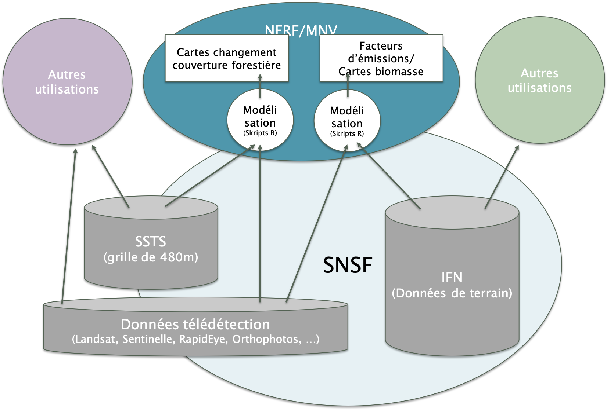
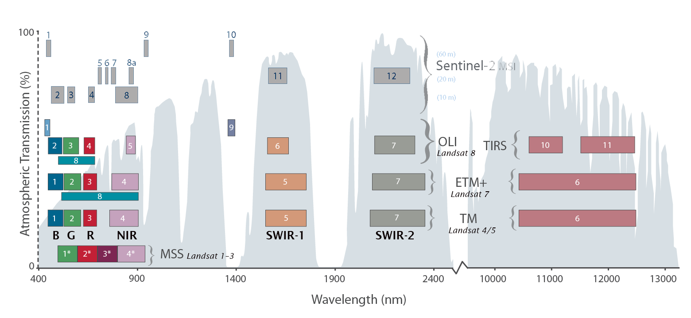
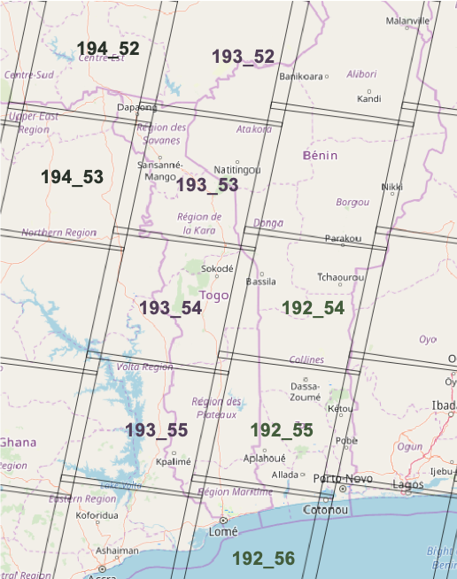
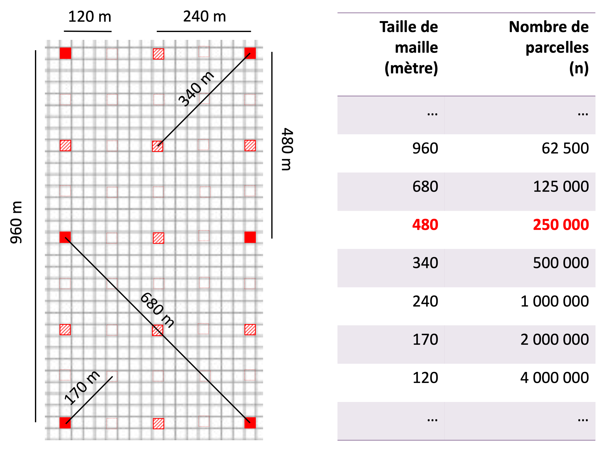
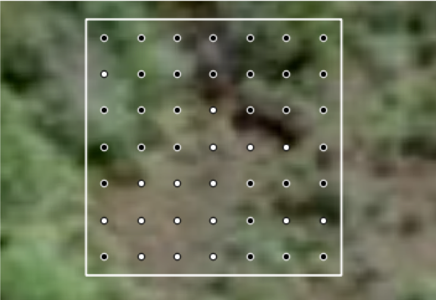
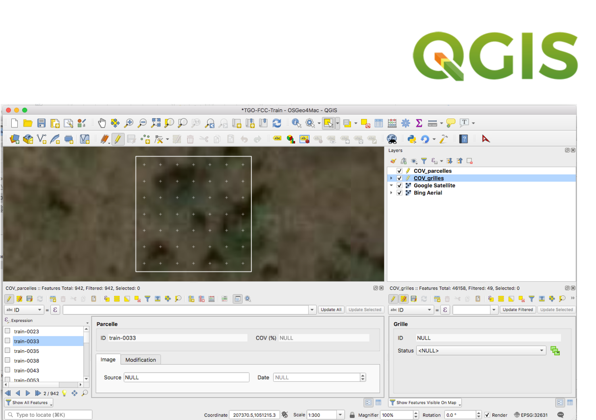
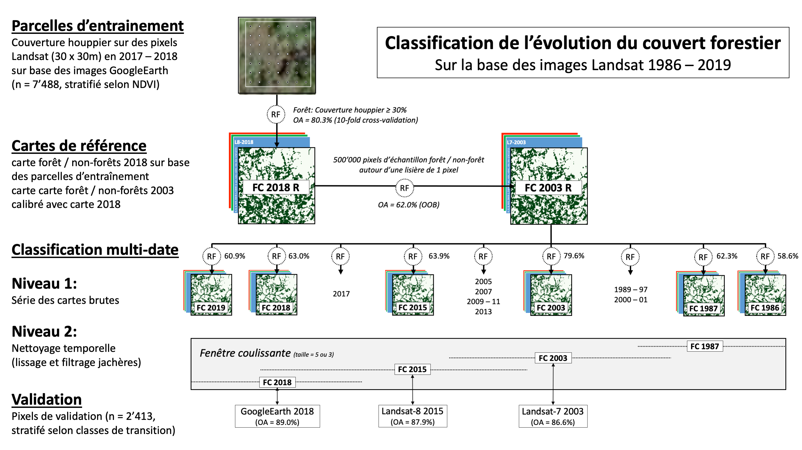
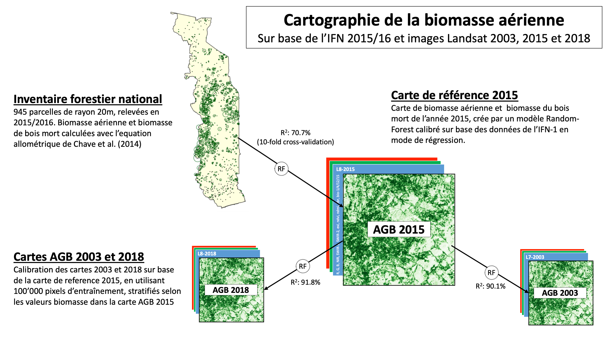

# Préface {-}

Ce manuel de référence à comme objectif de décrire le fonctionnement du **Système National de Surveillance des Forêts au Togo (SNSF)**. Les éléments traités sont les arrangements instutitionelles, l'implémentation de l'Inventaires Forestier National (IFN) et de Système Surveillance Terrestres par Satellite (SSTS) et l'approche technique pour en sortir les informations nécessaires pour le Niveau de Référence pour les Forêts du Togo (NRF) ainsi que pour le Monitoring, Reporting et Verification (MRV) dans le cadre de l'engagement du Togo pour le REDD+.

La partie [Analyses NRF/MRV](#NRF-MRV) décrit en détail les outils utilisés pour établir et le **Niveau de Référence pour les Forêts du Togo 1.0**, soumis au sécrétariat CCNUCC en Janvier 2020 et pour mettre à jour les analyses dans le cadre d'une surveillance de la biomasse forestier continue dans le cadre du Monitoring, Reporting et Verification pour la REDD+. Les résultats de ces analyses sont publiés ailleurs (liens sur les rapports sur le site CCNUCC et géoportail).

En cas de questions, veuillez contacter la [Coordination nationale REDD+ du Togo](http://www.reddtogo.tg/index.php/contacts)

<!--chapter:end:index.Rmd-->


# Introduction

L'objectif du Système National de Surveillance des Forêts (SNSF) est d'évaluer régulièrement **l'état des forêts togolaises et leur développement**. Dans le [code forestier du Togo](http://faolex.fao.org/docs/pdf/tog85011.pdf), la forêt est définie comme:

> un  espace  occupant  une  superficie  de  plus  de  0,5  hectare  avec  des arbres  atteignant  une  hauteur  supérieure  à  5  mètres  et  un  couvert arboré de plus de 10 pour cent, ou avec des arbres capables d’atteindre ces seuils in situ. 

Pour l'évaluation du développement des zones forestières, le SNSF distingue entre **terres forestières** avec un couvert des houppiers ≥ 30% et les **terres boisées** avec un couvert des houppiers entre 10% -- 30%.

Le SNSF combine les données recueillies sur le terrain avec les données des images satellites pour fournir des informations sur lévolution du l'ensemble des forêts dans le pays. Comme illustré dans l'image au-dessous et décrit dans les sections suivantes, **le SNSF actuel consiste de trois pilliers principaux:**

* Le [**Inventaire Forestier National (IFN)**](#IFN) recueille des informations détaillées sur l'état des forêts sur un nombre limité de placettes d'échantillonnage permanentes sur le terrain. 

* Au moyen du [**Système de Surveillance Terrestre par Satellite (SSTS)**](#SSTS), des informations sur la couverture et l'utilisation des sols sont recueillies sur un grand nombre de parcelles d'échantillonnage à partir d'images satellites. Avec l'aide du SSTS, les informations sur l'IFN peuvent être extrapolées à l'ensemble du pays.

* Le [**Niveau de Référence des Forêts (NRF) ainsi que le Monitoring, Reporting et Vérification (MRV)**](#NRF-MRV) des changements dans le réservoirs carbone forestiersest une applications du SNSF pour informer la communauté internationale sur l'engagement du Togo dans le cadre du mécanisme REDD+. Dans ce cadre, les données de la IFN sont utilisées pour déterminer le stockage du carbone dans la biomasse des arbres, tandis que les données de la SSTS sont utilisées pour déterminer le changement de la superficie forestière. Ensemble, cela se traduit par les pertes de carbone dues à la déforestation et la séquestration du carbone provenant du reboisement.



**En future, d'autres sources de données pourraient être intégrées au SNSF**, telles que

* le carbone organique du sol (prévu à rélever dans l'IFN-2)
* feux de brousse (base de données SANGE)
* dégradation des forêts (utilisation des images de haute résolution Sentinel-2)
* droits fonciers
* plantations
* exploitation du bois
* ...

Pour l'avenir, il est également prévu d'impliquer la population locale dans la surveillance des forêts, par exemple en signalant les activités irrégulières à l'aide d'une application pour smartphone.

<!--chapter:end:01_Introduction/00_introduction.Rmd-->

# Système nationale de surveillance des forêts (SNSF)

## Arrangements institutionelles

L'arrangement institutionnel propose pour le système national de suivi des forêts se presente comme ci-dessous. 

*	Le Ministère de l'Environnement, du Developpement Durable et de la Protection de la Nature (MEDDPN) &agrave travers la direction de l'environnement (DE) est chargee de la soumission des rapports (Communication Nationale et rapports biennaux) a la Convention cadre des nations unies sur le changement climatique

*	La cellule MRV de la Coordination nationale REDD+ situee a l'ODEF est responsable de la coordination de toutes les institutions et organisations impliquees dans l'alimentation du syst?me MRV. Cette cellule est l'entit? cl? charg? de faciliter et de soutenir les communications sur NRF/NERF du Togo. 

*	Le Groupe de travail (GT) NERF/MRV et l'?quipe nationale de suivi des for?ts sont chargÈs du travail et des dÈcisions et choix techniques sur les donn?es, r?sultats et m?thodologie adopt?s pour le NRF/MRV. C'est la cheville ouvri?re de la cellule MRV. Elles sont constitu?es des cadres des institutions qui interviennent dans le syst?me national de suivi des for?ts (SNSF).

*	La Direction de l'Environnement (DE) se charge des inventaires de gaz ? effet de serre (I-GES) de tous les secteurs mais assure la coh?rence des donn?es d'I-GES du secteur Agriculture, foresterie et autres affectations des terres (AFAT) avec les rapports qui seront soumis ? la CCNUCC. La DE se chargera d'assurer la coh?rence entre la m?thodologie utilis?e dans le cadre du NRF avec les donn?es d'I-GES du secteur AFAT.

*	L'Unit? de gestion de bases de donn?es cartographiques (UGBDC) de la Direction des ?tudes et de la planification (DEP), charg?e de la gestion de la cartographie des domaines forestiers du Togo ainsi que la Division cartographie et T?l?d?tection (DCT) de l'Officie de d?veloppement et d'exploitation des for?ts (ODEF) charg?e de la cartographie des for?ts class?es et plantations ?tatique se chargeront de produire les donn?es d'activit?s ? travers le syst?me de suivi des terres par satellite (SSTS).

*	La Ccellule de gestion de la base des donn?es des ressources foresti?res et des r?sultats de l'inventaire forestier national (CBDR-IFN) de la Direction des ressources foresti?res (DRF) et la Division cartographie et t?l?d?tection (DCT) de l'ODEF sont charg? de produire les facteurs d'?mission ? travers les inventaires forestier nationaux et les inventaires des plantations.

*	L'Agence nationale de gestion de l'environnement (ANGE) est charg?e de fournir les donn?es sur les feux de v?g?tation, 

*	la Direction g?n?rale de l'?nergie du minist?re des mines et ?nergie DGE/MME se chargera de fournir les donn?es sur la consommation en bois ?nergie, 

*	la Direction de la Statistique agricole de l'Informatique et de la Documentation (DCID) et l'Institut Togolais de Recherche Agronomique (ITRA) produiront des donn?es sur l'agriculture (superficie emblav?es et le cheptel), 

*	les donn?es de recherche des universit?s du Togo alimenteront le m?canisme MRV ainsi que le NRF 

*	L'Institut national de la statistique et des ?tudes ?conomiques et d?mographiques (INSEED) donnera des compl?ments d'informations sur la d?mographie et autres. 
L'assurance qualit? et le contr?le qualit? se fera ? travers l'?valuation ind?pendante interne du Laboratoire de biologie et ?cologie v?g?tale (LBEV) et le Laboratoire de recherche foresti?re (LRF) de l'universit? de Lom? (LBEV/UL) ainsi que la Direction g?n?rale de la cartographie (DGC). Les laboratoires universitaires LRF et LBEV ?valueront les m?thodes et nouveaux donn?es au fur et ? mesure qu'ils seront g?n?r?s.

<!--chapter:end:01_Introduction/01_arrangements.Rmd-->


## Organisation du travail {#SNSF-organisation}

### Logiciel et serveur

La cartographie des surfaces forestier et de la biomasse aérienne des arbres se fait avec le logiciel [R](https://www.r-project.org), dirigé à travers [RStudio](https://rstudio.com). Les scripts R sont mis à disposition dans un [dépot GitHub](https://github.com/ogardi/NERF-Togo). Les scripts dépendent des fois des outils GDAL disponible dans l'environnement, à installer pour les systèmes Linux avec `apt-get install python-gdal`.

Le traitement et l'analyse des images satellitaires demande des ressources intensives en terme de stockage de données (plusieurs TB) et capacité de calcul (plusieurs processeurs en parallèle). Les analyses pour le Niveau des emissions de référence pour les forêts du Togo (NERF 1.0) ont été éfféctués sur l'infrastructure informatique centrale de la BFH-HAFL (http://r.gro1.bfh.science, accès limité). Une fois la nouvelle infrastructure informatique puissante avec un serveur central au Ministère pour l'Environnement et Forêts (MERF) est  installé et disponible, les travaux peuvent être éffectués là. 

### Structure du répértoire

Les outils R dépendent d'une certaine structure des fichiers. Le répértoire de base `SNSF_Togo` est structuré comme suivant: 

```
SNSF_Togo
=========
├── data                                # Données de base #############################
    ├── GADM                              # <- frontières administratives
    ├── Landsat                           # <- images satellitaires
    ├── SRTM                              # <- données topographiques
    └── Worldclim                         # <- données climatiques
    
└── SNSF_v1.0_20200106                  # Répértoire SNSF v1.0 ########################
    ├── _set-up.R                         # [R] initialisation
    
    ├── 01_SSTS                           # SYSTÈME DE SURVEILLANCE TERRESTRE =========
        ├── 01_data                         #:: images et autres données pré-traités --
            ├── _prep-data.R                  # [R] prétraitement
            └── ...
            
        ├── 02_BdD                          #:: base de données SSTS ------------------
             ├── 01_reseau-SSTS               #:: réseau de parcelles SSTS
                 ├── _create-grid.R             # [R] création réseau SSTS    
                 └── ...
             ├── 02_train-plots               #:: parcelles d'entraînement 
                 ├── _create-train-plots.R      # [R] création parcelles d'entraînement                                
                 └── ...             
             └── 03_val-plots                 #:: parcelles de validation
                 ├── _create-val-plots.R        # [R] création parcelles de validation
                 └── ... 
        
    ├── 02_IFN                            # INVENTAIRE FORESTIER NATIONAL =============
        ├── 01_field-data                   # <- données d'inventaire -----------------
        └── ... 
    
    ├── 03_NRF-MRV                        # NIVEAU DE REFERENCE / MRV  ================
        └── 01_MCF                          #:: Modification Couvert Forestier --------
            ├── _01_get-train-points.R        # [R] création des point d'entraînement
            ├── _02_create-FC-maps.R          # [R] calibration des cartes
            ├── _03_clean-FC-maps.R           # [R] nettoyage des cartes
            ├── _04_get-val-points.R          # [R] création des points de validation
            ├── _05_validate-FC-maps.R        # [R] validation des cartes
            ├── _06_FC-maps-accuracy.R        # [R] analyse de la précision des cartes
            ├── _07_analyse-FC-maps.R         # [R] analyse des cartes 
            └── output                        #:: résultats / cartes
                ├── 01_ref-maps                 # => cartes référence
                ├── 02_raw-maps                 # => cartes brutes
                ├── 03_clean-maps               # => cartes nettoyées
                ├── 04_validation               # => résultats validation
                └── 05_results                  # => résultats surfaces
        
        ├── 02_AGB                          #:: cartographie biomasse -----------------
            ├── _1_compile-AGB.R              # [R] évaluer inventaire
            ├── _2_create-AGB-maps.R          # [R] calibration des cartes
            ├── _3_clean-AGB-maps.R           # [R] nettoyage des cartes
            ├── _4_analyze-AGB.R              # [R] analyse des cartes
            └── output                        #:: cartes biomasse
                ├── 01_ref-maps                 # => cartes de référence
                └── 02_results                  # => résultats biomasse
        
        └── report                          #:: rapport NRF/MRV -----------------------
        
    ├── 04_manual                         #:: cette documentation du SNSF =============
    └── docs                              #:: cette documentation en HTML
    
    
└── SNSF_v1.x                           # Répértoire SNSF version actualisé ###########
```

<!-- old structure
```
NRF_Togo

├── data                                    # Données de base ########################
    ├── GADM                                  # frontières administratives
    ├── IFN                                   # inventaire forestier national
    ├── Landsat                               # images satellitaires
    ├── SRTM                                  # données topographiques
    └── Worldclim                             # données climatiques
    
└── NRF_v1.0                                # Répétoire projet NRF v1.0 #############
    ├── input                                 # données spécifiques du projet
        ├── 1_images                            # images pre-traités                              
        ├── 2_train-plots                       # données d'entraînement                       
        └── 3_val-plots                         # données de validation
    ├── src                                   # scripts R ----------------------------
        ├── 0_set-up.R                          # initialisation
        ├── 1_prepare-images.R                  # préparation des images  
        ├── AGB                                 # cartographie biomasse
            ├── 2_compile-IFN.R                   # évaluer inventaire
            ├── 3_create-AGB-maps.R               # calibration des cartes
            ├── 4_clean-AGB-maps.R                # nettoyage des cartes
            └── 5_analyze-AGB.R                   # analyse des cartes
        └── FCC                                 # cartographie surfaces forestiers
            ├── 2_create-train-points.R           # création des point d'entraînement
            ├── 3_create-fc-maps.R                # calibration des cartes
            ├── 4_clean-fc-maps.R                 # nettoyage des cartes
            ├── 5_create-val-points.R             # création des points de validation
            ├── 6_validate-fc-maps.R              # validation des cartes
            ├── 7_fc-maps-accuracy.R              # analyse de la précision des cartes
            └── 8_analyse-fc-maps.R               # analyse des cartes  
    ├── output                                # résultats / cartes -------------------
        ├── 1_forest-cover                      # cartes surfaces forestiers
            ├── 1_ref-maps                        # cartes référence
            ├── 2_raw-maps                        # cartes brutes
            ├── 3_clean-maps                      # cartes nettoyées
            ├── 4_validation                      # résultats validation
            └── 5_results                         # résultats surfaces
        └── 2_biomass                           # cartes biomasse
            ├── 1_ref-maps                        # cartes de référence
            └── 5_results                         # résultats biomasse
    ├── report                                # rapport des résultats ----------------
    └── manuel                                # cette documentation ------------------
    
└── NRF_v1.x                                # Un autre répétoire projet #########
```
-->

La structure du répertoire est définit dans le script [0_set-up.R](#NRF-set-up.R) et peut être ajousté.

C'est seulement les répétoires `src` et `manual` qui sont mis à diposition dans le dépôt [GitHub](https://github.com/ogardi/NERF-Togo). Les autres répétoires et données doivent être installés manuellement.

### Création d'un nouveau projet

Pour la création d'un nouveau projet, le plus simple est de copier un projet existant, normalement le projet sur lequel on aimeriait continuer le travail. On peut faire ça à travers RStudio, SFTP ou directement sur le server par exemple `cp -r 2019_NERF_v1 2020_MNV_v0`. Après on efface les résultat de l'ancien projet `rm -r 2020_MNV_v0/output/*`. Les rapports on peut laisser, mais il faut les rédiger à la fin.

### Définition des variables {#NRF-set-up.R}

#### Description {-}

Le traitement des images ce fait par executer les scripts R, un après l'autre. Tout d'abord on ouvre et execute le script `0_set-up.R` pour charger les librairies et définir des variables qu'on utilise également dans les autres scripts. On peut également éxécuter l'ensemble du script par la commande R `source(0_set-up.R)`.

Les noms des variables définies dans le script `0_set-up.R` sont écrits en majuscules. Ils sont stockés dans l'environnement R et sont disponibles pour tous les autres scripts après l'exécution du script.

Avant l'exécution du script, les variables sont ajustées si nécessaire, notamment les informations sur la période analysée `PERIOD` et les années à prendre en compte pour les différentes évaluations `JNT.YEARS`, `VAL.YEARS` et `REF.YEARS`.

#### *0_set-up.R* {-}

```{r, code=readLines("../.Rprofile"), eval=FALSE}
```

<!--chapter:end:01_Introduction/02_organisation.Rmd-->


# Système de Surveillance Terrestre {#SSTS}

Le Système de Surveillance Terrestre par Satellite (SSTS) consiste d'un réseau de parcelles d'échantillonnage, dont la **couverture et l'utilisation des terres** sont régulièrement enregistrées par photo-interprètes sur base des images satellitaires. Pour le moment, les attributs enregistrés dans le SSTS sont :

* [Couverture des houppiers](#SSTS-couverture-houppiers)
* [Occupation des terres](#SSTS-occupation-terres)

<!--chapter:end:02_STSS/00_STSS.Rmd-->


## Images satellitaires

Actuellement, l'analyse de l'évolution du couvert forestier est principalement basée sur les **images satellitaires Landsat**, qui sont disponibles gratuitement dans les archives de l'USGS. Les missions Landsat-4 à Landsat-8 produisent des images de résolution spatiale et radiométrique comparable depuis les années 1980.  Les images brutes sont corrigées géométriquement et radiométriquement par l'USGS ([USGS Collection 1 Level-2 Surface Reflection Product](https://www.usgs.gov/land-resources/nli/landsat/landsat-surface-reflectance)).

La résolution spatiale des images est de **30 mètres**. Les bandes spectrales utilisées sont **B, G, R, NIR, SWIR-1 et SWIR-2** (voir les désignations des bandes dans la figure ci-dessous).



Le territoire du Togo est couvert par un total de 9 images Landsat (scènes WRS 2). Les zones couvertes par les différentes scènes sont indiquées dans la figure ci-dessous.



Les images Landsat utilisées pour l'évaluation du couvert forestier ont été prises idéalement à la **fin de la saison sèche, c'est-à-dire de (Nov), Déc, Jan, (Fév)** et sont disponibles en **bonne qualité** (sans nuages ou seulement légèrement couvertes par des nuages et des ombres) **pour la même date sur l'ensemble du chemin WRS 2** respectif. Pour les années de référence, là ou on aimerait des cartes qui couvrent l'ensemble du territoire du Togo, des images correspondantes sont nécessaires pour tous les trois chemins WRS 2.

Le tableau ci-dessous présente les images satellites utilisées pour l'analyse du couvert forestier au Togo. Les **années de référence** utilisées pour le NRF et les images correspondantes sont indiquées en caractères gras. Ce n'est que pour l'année 1991 que les images de différentes dates d'enregistrement ont été combinées pour le chemin WRS 193. L7* marque les images Landsat-7 avec des lacunes dans les données (SLC-off). La colonne **GoogleEarth** montre la répartition des dates des images de très haute résolution disponibles sur [GoogleEarth](https://www.google.com/maps/place/Togo/@6.8865979,0.6126023,1079m/data=!3m1!1e3!4m5!3m4!1s0x1023e1c113185419:0xfaae5b301ad19360!8m2!3d8.619543!4d0.824782). Seules les images de référence GoogleEarth de 2017 -- 2018 ont été utilisées pour la calibration de la carte forêt/non-forêt 2018.


|          |      WRS 192<br>^054,055,056^ |  WRS 193<br>^052,053,054,055^ |          WRS 194<br>^052,053^ | GoogleEarth<br>^Référence^ |
|---------:|------------------------------:|------------------------------:|------------------------------:|---------------------------:|
|   2019   |	             L8 / 23.12.18   |               L8 / 16.02.19   |               L8 / 22.01.19   |                     **++** |
| **2018** |	           **L8 / 05.01.18** |             **L8 / 12.01.18** |             **L8 / 18.12.17** |                **+++++++** |
|   2017   |	             L8 / 10.02.17   |               L8 / 25.01.17   |               L8 / 31.12.16   |                    **+++** |
|   2016   |                         ---   |                         ---   |                         ---   |                       (+)  |
| **2015** |	           **L8 / 13.01.15** |             **L8 / 04.01.15** |             **L8 / 27.01.15** |                       (+)  |
|   2014   |                         ---   |                         ---   |                         ---   |                      (++)  |
|   2013   |	            L7* / 31.01.13   |              L7* / 23.03.13   |              L7* / 28.12.12   |                       (+)  |
|   2012   |                         ---   |                         ---   |                         ---   |                      (++)  |	
|   2011   |	            L7* / 10.01.11   |                         ---   |                         ---   |                       (+)  |
|   2010   |	            L7* / 21.01.10   |                         ---   |                         ---   |                       (+)  |
|   2009   |	            L7* / 27.01.09   |                         ---   |                         ---   |                            |
|   2008   |                         ---   |                         ---   |                         ---   |                            |
|   2007   |	            L7* / 30.12.06   |              L7* / 22.01.07   |              L7* / 12.12.06   |                            |
|   2006   |                         ---   |                         ---   |                         ---   |                            |
|   2005   |	            L7* / 24.12.04   |               L5 / 01.02.05   |              L7* / 22.12.04   |                            |
|   2004   |                         ---   |                         ---   |                         ---   |                            |
| **2003** |	           **L7 / 04.01.03** |             **L5 / 27.01.03** |             **L7 / 17.12.02** |                       (.)  |
|   2002   |                         ---   |                         ---   |                         ---   |                            |
|   2001   |	             L7 / 13.12.00   |               L7 / 12.01.01   |                         ---   |                       (.)  |
|   2000   |	             L7 / 04.02.00   |                         ---   |                         ---   |                            |
|    ...   |                         ...   |                         ...   |                         ...   |                            |
|   1997   |	             L5 / 10.02.97   |                         ---   |                         ---   |                            |
|    ...   |                         ...   |                         ...   |                         ...   |                            |
|   1991   |	             L4 / 03.01.91   | L4 / 10.01.91 & L5 / 28.11.89 |                         ---   |                            |
|    ...   |                         ...   |                         ...   |                         ...   |                            |
| **1987** |             **L5 / 31.12.86** |             **L5 / 23.01.87** |             **L5 / 29.12.86** |                            |
|   1986   |	             L5 / 13.01.86   |               L5 / 06.03.85   |               L5 / 11.01.86   |                            |

	 	 	 
	 	 	 
### Acquisition des images

Ouvrir le site [USGS Earthexplorer](https://earthexplorer.usgs.gov). Dans la fenêtre `Search Criteria` il faut selectionner la période pour laquelle on cherche des images (Nov - Jan). Dans la fenêtre `Data Sets`, les produits Landsat Level-2 (Surface Reflectance) sont séléctionnés. Dans la fenêtre `Additional Criteria` il faut choisir les scènes (chemin 192: 054-056 /  chemin 193: 052-055 / chemin 194: 052-053).


Parmi les images disponibles, on sélectionne celles qui sont disponibles à la même date et en bonne qualité pour l'ensemble du chemin WRS.
On copie les identifier des images à télécharger dans un fichier txt.

Ensuite on ouvre le site [USGS ESPA](https://espa.cr.usgs.gov/ordering/new/) pour commander les images choisi. On charge le fichier txt avec les identifier des images et on commande les bandes `Surface Reflectance` et les indices spéctrales (voir image au-dessous). Pour commander des images, il faut qu'on a un compte USGS.


Une fois on est notifié par eMail que les images sont prêts, on les téléchargent manuellement ou tous ensemble avec le [USGS bulkdownloader](https://github.com/USGS-EROS/espa-bulk-downloader) et la commande `download_espa_order.py -u [nom d'utilisateur] -o ALL -d [répértoire]`. On dézip les images et les rangent dans le répétoire `data/Landsat` sous la scène et l'année correspondante. Pour des images de l'hiver 2019/20, l'année correspondante est 2020.	


### Prétraitement des images

#### Description {-}

Le premier traitement est la préparation des images Landsat et autres variables utilisés pour modéliser la surface forestier ou la biomasse aérienne comme les données topographique et climatiques. L'objectif est qu'on prépare avec les données brutes un jeu de données raster complet sur le même extent (territoir du Togo) et avec la même résolution spatiale de 30 mètres (résolution de base des images Landsat).

On ouvre le script `1_prepare-images.R` et on modifie la liste des images Landsat à utiliser (`in.image.list`), par exemple par ajouter les nouveaux image à considérer dans les analyses:

```{r eval=FALSE, tidy=FALSE}
p192.2019 = list(
  paste0(DATA.DIR, "/Landsat/192_054/2019/LC081920542018122301T1-SC20190405164258/"),
  paste0(DATA.DIR, "/Landsat/192_055/2019/LC081920552018122301T1-SC20190405163359/"),
  paste0(DATA.DIR, "/Landsat/192_056/2019/LC081920562018122301T1-SC20190405163342/"))
...
p193.2019 = list(
  paste0(DATA.DIR, "/Landsat/193_052/2019/LC081930522019021601T1-SC20190405183839/"),
  paste0(DATA.DIR, "/Landsat/193_053/2019/LC081930532019021601T1-SC20190405181518/"),
  paste0(DATA.DIR, "/Landsat/193_054/2019/LC081930542019021601T1-SC20190405183609/"),
  paste0(DATA.DIR, "/Landsat/193_055/2019/LC081930552019021601T1-SC20190405181507/"))
...
p194.2019 = list(
  paste0(DATA.DIR, "/Landsat/194_052/2019/LC081940522019012201T1-SC20190405172019/"),
  paste0(DATA.DIR, "/Landsat/194_053/2019/LC081940532019012201T1-SC20190405172055/"))
```

Outre la définition des images à traiter, le script définit une fonction `prepare.image` pour stacker les différentes bandes des images Landsat, pour les fusioner, masquer et couper les images Landsat chemin par chemin  (WRS2 paths 192, 193 et 194 pour Togo). Par défaut, les images qui ont déjà été traité (`filename` existe déjà) ne sont plus traité (`overwrite=FALSE`).

```{r eval=FALSE} 
prepare.image(in.image.dirs, ext=NULL, filename=NULL, overwrite=FALSE, log=TRUE)
```

Dans la deuxième partie du script, là où c'est noté `# DO THE WORK ---------`, on lance le traitement des images. Avec le code `foreach(...) %dopar% { ... }` on lance le traitement de chaque chemin pour chaque année sur des différents processeurs au parallèle. À la fin du script on 

- transforme les images du chemin 194 du système de coordonnées UTM 30 vers UTM 31
- prépare les données topographiques SRTM et les données climatiques Worldclim v2
- produit des thumbnails des images Landsat et Worldclim v2 en format JPEG (voir example au-dessous)


Les images prétraités sont sauveguarder dans le répétoire `input/1_images` du projet, ensemble avec des Thumbnails des chemins. Dans une prochaîne étape, les images sont néttoyées de l'eau, nuages et ombres en utilisant les bandes Landsat de qualité des pixels. Finalement également les données topographiques (SRTM) et climatiques (Worldclim v2) sont préparés.

#### Example {-}

```{r, echo=FALSE, out.width="33%"}
knitr::include_graphics(c("images/p194_2019.jpeg","images/p193_2019.jpeg", "images/p192_2019.jpeg"))
``` 
**Images Landsat de l'année 2019:** chemin p194 composé de 2 scénes du 22.01.2019 / p193 avec 4 scènes du 16.02.2019 / p192 avec 3 scènes du 23.12.2018

```{r, echo=FALSE, out.width="25%", fig.show='hold', fig.align='default'}
knitr::include_graphics(c("images/wc2.0_30s_bio_Togo-01.jpeg","images/wc2.0_30s_bio_Togo-04.jpeg", "images/wc2.0_30s_bio_Togo-12.jpeg", "images/wc2.0_30s_bio_Togo-15.jpeg"))
``` 
**Données bioclimatiques Worldclim v2:** température annuelle  moyenne (BIO1) / saisonalité de la température (BIO4) / précipitation annuelle (BIO12) / saisonalité de la précipitation (BIO15)

#### _1_prepare-images.R_ {-}

```{r, code=readLines("../01_SSTS/01_data/_src/prep-Landsat.R"), eval=FALSE}
```


<!--chapter:end:02_STSS/01_data.Rmd-->


## Réseau d'échantillonnage

Les parcelles d'échantillonages couvrent une surface de 30 x 30 mètres et **correspondent en taille, forme et position aux pixels des images Landsat**. Les parcelles d'échantillonnage ont été régulièrement réparties sur le territoire du Togo, sur une grille d'une taille de maille de 480 mètres (tous les 16 pixels Landsat) ou 4,3 parcelles d'échantillonnage par km^2^. Sur l'ensemble du territoire togolais, cela donne un réseau de 250 000 parcelles. 

Si nécessaire pour autres utilisation, la taille de maille de 480 mètres permet d'enlargir la maille à 679 ou 960 mètres. D'autre part, il est également possible de comprimer la maille à 340, 240, 170, 120, 85, ... mètres.


        
La réseau d'échantillonage avec une taille de maille de 480 mètres est crée avec le code R suivant:

```{r eval=FALSE}
res <- 480

x.min <- res * extent(TGO)@xmin %/% res
x.max <- res * extent(TGO)@xmax %/% res
y.min <- res * extent(TGO)@ymin %/% res
y.max <- res * extent(TGO)@ymax %/% res


frame.points <- SpatialPoints(expand.grid(seq(x.min, x.max, by=res), seq(y.min, y.max, by=res)), proj4string=utm.31)[TGO]
```


## Attributs enregistrés


### Couverture des houppiers {#SSTS-couverture-houppiers}

Pour détérminer la couverture des houppiers une **grille de 7 x 7 points** est définit à l'intérieur de chaque parcelles d'échantillonage. Pour chaque point de ce grille, les photo-interprètes détérminent sur base des images de très haute résolution disponible en GoogleEarth, si **le point touche l'houppier d'un arbre ou non**. La couverture des houppiers est en suite détérminé par le nombre des points qui tombent sur un arbre par rapport au ombre total des points (n = 49).



La grille de 7 x 7 points est crée avec le code suivant. L'attribution est fait par les photo-interprètes en QGIS, avec l'image GoogleEarth comme carte de base. La date d'acquistion de l'image GoogleEarth utilisé est également enregistré. Elle est obtenu par GoogleEarth Pro (plugin QGIS `send2google_earth`).

```{r eval=FALSE}
grid.size <- 7
res <- res(landsat.grid)[1]
offset <- c(res/grid.size/2 + (0:(grid.size-1))*res/grid.size)

# split the plots for parallel processing
subsets <- split(train.plots, f=1:86)

train.grids <- foreach(subset=subsets, .combine=rbind, .multicombine=TRUE) %dopar% { 
  grids <- SpatialPointsDataFrame(data.frame(x = 0, y = 0), data=data.frame(PLOTID = 0, SAMPLEID = 0, GRIDPOINT = 0))[-1,]
  for(p in 1:length(subset)) {
    plot <- subset[p,]
    ext <- extent(plot)
    grids <- bind(grids, SpatialPointsDataFrame(expand.grid(ext@xmin+offset, ext@ymin+offset), data=data.frame(PLOTID = plot$PLOTID, SAMPLEID = plot$SAMPLEID, GRIDPOINT = 1:grid.size^2)))
  }
  grids
}
```

### Occupation des terres {#SSTS-occupation-terres}

L'occupation des terres et le changement de l'occupation des terres est **déterminé sur base des images Landsat**. Trois différentes catégories sont distingués:

- forêt (couverture houppier ≥ 30%)
- terre boisée (couverture houppier entre 10% et 30%)
- non-forêt (couverture houppier < 10%)

**La couverture des houppiers est utilisé pour détérminer l'occupation des terres sur l'image Landsat de la date correspondate.** À partir de cette référence, l'occupation des terres est détérminé pour les autres dates de référence 1987 -- 2003 -- 2015 -- 2018. La figure suivante illustre la procédure:


## Mise en oeuvre du SSTS

Actuellement, les parcelles d'échantillonnage du SSTS ainsi que la grille de points pour déterminer la couverture des houppiers sont stockées sous forme des fichiers Shapefile. L'acquisition des attributs est effectuée par les photo-interprètes à l'aide d'un formulaire défini dans un projet QGIS.



Un SSTS basé sur des fichiers limite la complexité de la structure des données (par exemple, l'enregistrement récurrent des mêmes parcelles sur des images de différentes années) ainsi que le travail parallèle de différents photo-interprètes sur les mêmes données. Actuellement, des travaux sont en cours pour transférer le SSTS vers une base de données géographiques (PostGIS) sur un serveur central au Ministère de l'Environnement et des Ressources Forestières (MERF) et pour définir un formulaire QGIS qui permet à plusieurs personnes de travailler simultanément sur les données.


<!--chapter:end:02_STSS/02_sampling-plan.Rmd-->


# Inventaire Forestier National {#IFN}

Le premier inventaire forestier national a ete realise la GIZ. Le deuxième inventaire sera realise par la direction de l'environnment du Mininstère de l'environnment, du developpement durable et de la protection de la nature. 

<!--chapter:end:03_IFN/00_IFN.Rmd-->


# Analyses NRF/MRV {#NRF-MRV}

Le Togo a soumis son premier **Niveau de Référence pour les Forêts (NRF 1.0)** en Janvier 2020 ([*Lien sur le site CCNUCC*](TODO)). Il est basé sur l'évolution de la couverture forestier entre 2003 -- 2018 (pertes et gains des terres forestières à une couverture du houppier ≥ 30%) et le stockage de carbone dans la biomasse aérienne des arbres (incl. bois mort sur pied)

Les données de base qu'on a utilisé pour effectuer ce travail sont: 

- **les images Landsat de l'archive USGS (1985 -- 2019)** et les **données climatiques Worldclim v2** pour la la cartographie de l'évolution des surfaces forestiers et la cartographie de la biomasse
- **les données du SSTS (état 2019)** sur la couverture du houppier et l'utilisation des terres pour la calibration et la validation des cartes sur l'évolution des surfaces forestier
- **les données dendrométriques du IFN-1 (2015/16)** pour déterminer le stockage de carbone dans la biomasse aérienne par parcelle et la calibration des cartes de la biomasse

Ce chapitre décrit **l'approche méthodologique et les outils techniques** utilisés pour établir ce NERF. C'est un travail en cours. Le même approche sera utilisés a) pour améliorer le NERF avec des nouvelles données et/ou mèthodes et b) pour mettre à jour régulièrement les analyses dans le cadre du Monitoring, reporting et vérification (MRV). 

Chaque section commence par une description de la méthodologie utilisée et des références aux points clés dans le script R correspondant, suivie par une présentation exemplaire des résultats de cette étappe et enfin du code R commenté.

- **Section \@ref(NRF-organisation)** décrit les logiciels et les infrastructures utilisés ainsi que la structure de données sur laquelle les analyses sont basées.
- **Section \@ref(NRF-preparation)** couvre les différentes étapes de la préparation des données, en particulier la création d'un nouveau projet basé sur un projet existant, l'acquisition de nouvelles images satellites et leur préparation pour les analyses.
- **Section \@ref(NRF-analyse-FCC)** décrit les différentes étapes nécessaires pour la cartographie des surfaces forestières et leur évolution, de la séléction des parcelles d'entraînements à la classification des séries de cartes, leur néttoyage et validation.
- **Section \@ref(NRF-analyse-AGB)** décrit les différentes étapes nécessaires pour la cartographie des la biomasse aérienne, de l'évaluation des données de l'IFN, à la calibration des cartes de biomasse leur néttoyage et l'analyse de l'évolution de la biomasse dans le temps.

<!--chapter:end:04_NRF-MRV/00_NERF-MRV.Rmd-->


## Analyse surfaces forestiers {#NRF-analyse-FCC}

L'analyse des surfaces forestiers est fait par une **classification supervisée**. Les données du SSTS sur la couverture des houppiers (Section \@ref(SSTS-couverture-houppiers)) est utilisé pour calibrer un modèle de classification Random Forest sur base des images satellitaires Landsat et les données climatiques Worldclim v2. Tous les parcelles d'entraînement avec une **couverture des houppiers ≥ 30%** sont considérées comme forêt, les autres comme non-forêts. 

Le schéma suivant montre les étapes pour la production des cartes forêt/non-forêt sur toute la période 1986 -- 2019:



Vue que les données sur la couverture des houppier et seulement disponible pour les années récentes (à cause d'une disponibilité limité des images de très haute résolution), c'est seulement la carte forêt/non-forêt 2018 qui a été produit sur base des parcelles d'entraînement du SSTS. Cette **carte de référence 2018 est utilisé comme base pour la calibration des modèles de classification pour les autres dates** pour lesquelles des images Landsat sont disponible.

Tout d'abord la carte de référence 2018 est utilisé pour calibrer la classification d'une carte forêt/non-forêt en 2003. C'est cette **carte de référence 2003 qu'on a utilisé pour calibrer les autres cartes de 1986 -- 2018**. On a choisi de faire la classification de toute la serie des images sur la carte de référence 2003, parce que les images Landsat 2003 sont de très bonne qualité (et donc la carte est probablement aussi de bonne qualité) et parce que l'année 2003 se trouve au milieu de la période analysée. Si on prend directement la carte forêt/non-forêt 2018 comme référence pour la calibration de la série 1986 -- 2018, on observe une généralisation de la surface forestier le plus on s'éloigne de la date 2018, donc un changement de la surface forestier qui est plutôt un artefact de la méthode que une changement d'occupation des terres.

Dans la suite, **la série des cartes forêts/non-forêts 1986 -- 2018 est nettoyé par une lyssage temporelle**, pixel par pixel, avec un filtre majoritaire (fenêtre coulissante d'une taille de 5). Finalement, une reforestation est seulement constaté si on a observé la forêt pour une période de 10 ans et plus.

**Les cartes nettoyés de 2003, 2015 et 2018 sont validés avec les données SSTS** sur l'occupation des terres (Section \@ref(SSTS-occupation-terres)) et les matrices d'erreurs sont utilisées pour détérminer la précision des cartes individuelles et des différents changements d'occupation des terres, en utilisant la méthode de [Olofsson et al. (2014)](https://www.sciencedirect.com/science/article/abs/pii/S0034425714000704)


<!--chapter:end:04_NRF-MRV/01_analyse-FCC/00_analyse-FCC.Rmd-->


### Parcelles d'entraînement

#### Description {-}

Description de la méthodologie / script

#### _FCC/2_create-train-points.R_ {-}

```{r, code=readLines("../03_NRF-MRV/01_MCF/_src/01_get-train-points.R"), eval=FALSE}
```


<!--chapter:end:04_NRF-MRV/01_analyse-FCC/01_get-train-points.Rmd-->


### Calibration et classification

#### Description {-}

Description de la méthodologie / script

#### _FCC/3_create-fc-maps.R_ {-}

```{r, code=readLines("../03_NRF-MRV/01_MCF/_src/02_create-FC-maps.R"), eval=FALSE}
```


<!--chapter:end:04_NRF-MRV/01_analyse-FCC/02_create-FC-maps.Rmd-->


### Nettoyage des cartes brutes {#NRF-clean-fc-maps}

#### Description {-}

Description de la méthodologie / script

#### _FCC/4_clean-fc-maps.R_ {-}

```{r, code=readLines("../03_NRF-MRV/01_MCF/_src/03_clean-fc-maps.R"), eval=FALSE}
```


<!--chapter:end:04_NRF-MRV/01_analyse-FCC/03_clean-FC-maps.Rmd-->


### Parcelles de validation

#### Description {-}

Description de la méthodologie / script

#### _FCC/5_create-val-points.R_ {-}

```{r, code=readLines("../03_NRF-MRV/01_MCF/_src/04_get-val-points.R"), eval=FALSE}
```


<!--chapter:end:04_NRF-MRV/01_analyse-FCC/04_get-val-points.Rmd-->


### Validation des cartes

#### Description {-}

Description de la méthodologie / script

#### _FCC/6_validate-fc-maps.R_ {-}

```{r, code=readLines("../03_NRF-MRV/01_MCF/_src/05_validate-FC-maps.R"), eval=FALSE}
```


<!--chapter:end:04_NRF-MRV/01_analyse-FCC/05_validate-FC-maps.Rmd-->


### Analyse de la précision

#### Description {-}

Description de la méthodologie / script

#### _FCC/7_fc-maps-accuracy.R_ {-}

```{r, code=readLines("../03_NRF-MRV/01_MCF/_src/06_FC-maps-accuracy.R"), eval=FALSE}
```


<!--chapter:end:04_NRF-MRV/01_analyse-FCC/06_FC-maps-accuracy.Rmd-->


### Production des résultats

#### Description {-}

Description de la méthodologie / script

#### _FCC/8_analyse-fc-maps.R_ {-}

```{r, code=readLines("../03_NRF-MRV/01_MCF/_src/07_analyse-FC-maps.R"), eval=FALSE}
```


<!--chapter:end:04_NRF-MRV/01_analyse-FCC/07_analyse-FC-maps.Rmd-->


## Analyse biomasse aérienne {#NERF-analyse-AGB}




<!--chapter:end:04_NRF-MRV/02_analyse-AGB/00_analyse-AGB.Rmd-->


### Analyse des données IFN

#### Description {-}

Description de la méthodologie / script

#### _AGB/2_compile-IFN.R_ {-}

```{r, code=readLines("../03_NRF-MRV/02_AGB/_src/01_compile-AGB.R"), eval=FALSE}
```


<!--chapter:end:04_NRF-MRV/02_analyse-AGB/01_compile-IFN.Rmd-->


### Calibration et prédiction

#### Description {-}

Description de la méthodologie / script

#### _AGB/3_create-AGB-maps.R_ {-}

```{r, code=readLines("../03_NRF-MRV/02_AGB/_src/02_create-AGB-maps.R"), eval=FALSE}
```


<!--chapter:end:04_NRF-MRV/02_analyse-AGB/02_create-AGB-maps.Rmd-->


### Nettoyage des cartes brutes

#### Description {-}

Description de la méthodologie / script

#### _AGB/4_clean-AGB-maps.R_ {-}

```{r, code=readLines("../03_NRF-MRV/02_AGB/_src/03_clean-AGB-maps.R"), eval=FALSE}
```


<!--chapter:end:04_NRF-MRV/02_analyse-AGB/03_clean-AGB-maps.Rmd-->


### Production des résultats

#### Description {-}

Description de la méthodologie / script

#### _AGB/5_analyze-AGB.R_ {-}

```{r, code=readLines("../03_NRF-MRV/02_AGB/_src/04_analyze-AGB-maps.R"), eval=FALSE}
```


<!--chapter:end:04_NRF-MRV/02_analyse-AGB/04_analyze-AGB-maps.Rmd-->

