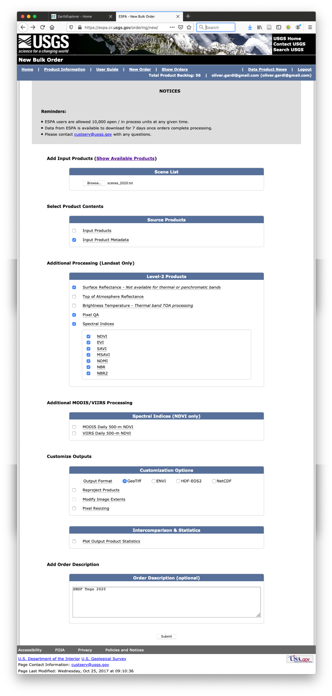

# Pour commencer

## Création d'un nouveau projet

Pour la création d'un nouveau projet, le plus simple est de copier un projet existant, normalement le projet sur lequel on aimeriait continuer le travail. On peut faire ça à travers RStudio, SFTP ou directement sur le server par exemple `cp -r 2019_NERF_v1 2020_MNV_v0`. Après on efface les résultat de l'ancien projet `rm -r 2020_MNV_v0/output/*`. Les rapports on peut laisser, mais il faut les rédiger à la fin.  

## Acquisition des images

Ouvrir le site [USGS Earthexplorer](https://earthexplorer.usgs.gov). Dans la fenêtre `Search Criteria` il faut selectionner la période pour laquelle on cherche des images (Nov - Jan). Dans la fenêtre `Data Sets`, il faut sélectionner les produits Landsat Level-2 (Surface Reflectance). Dans la fenêtre `Additional Criteria` il faut choisir les scènes (chemin 192: 054-056 /  chemin 193: 052-055 / chemin 194: 052-053).

On prend le date sur les images de tout le chemin sont de meilleure qualité. On copie les identifier des images à télécharger dans un fichier text.

Ensuite on ouvre le site [USGS ESPA](https://espa.cr.usgs.gov/ordering/new/) pour commander les scènes.  On charge le fichier text avec les scènes et on commande les bandes surface reflectances et les indices. Pour commander des images, il faut qu'on a un compte USGS.

Une fois on est notifié par eMail que les images sont prêts, on les téléchargent manuellement ou tous ensemble avec le [USGS bulkdownloader](https://github.com/USGS-EROS/espa-bulk-downloader) et la commande `download_espa_order.py -u oliver.gardi@gmail.com -o ALL -d NERF_Togo/data/Landsat`. On dézip les images et les rangent dans le répétoire `data/Landsat` sous la scène et l'année correspondante. Pour des images de l'hiver 2019/20, l'année correspondante est 2020.