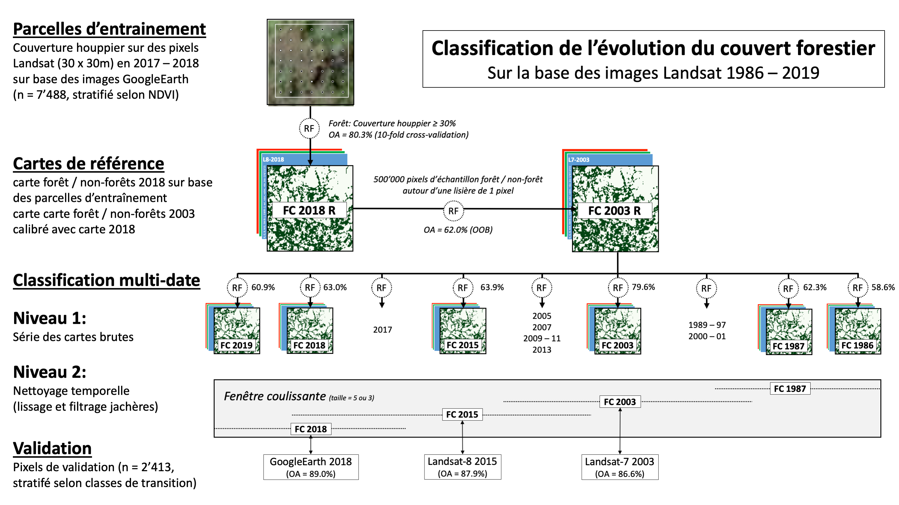
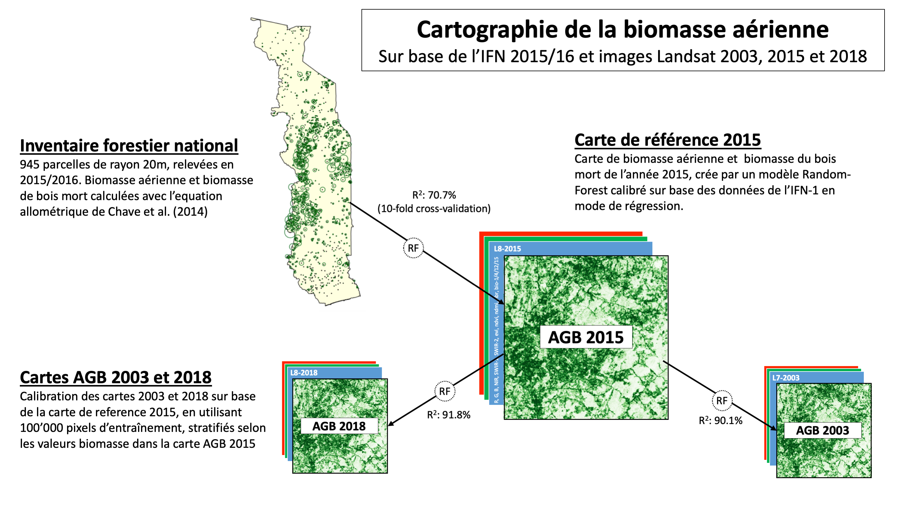

# Préface {-}


Ce manuel d'opération à comme objectif de décrire le fonctionnement du **Système National de Surveillance des Forêts au Togo (SNSF)**. Les éléments à traiter sont les arrangements instutitionelles, l'implémentation de l'Inventaires Forestier National (IFN) et de Système Surveillance Terrestres par Satellite (SSTS) et l'approche technique pour en sortir les informations nécessaires pour le Niveau des emissions de référence pour les forêts du Togo (NERF) ainsi que pour le Monitoring, Reporting et Verification (MRV) dans le cadre de l'engagement du Togo pour le REDD+.

Le manuel NERF/MRV décrit en détail les outils utilisés pour établir et le **Niveau des emissions de référence pour les forêts du Togo** et pour mettre à jour les analyses dans le cadre d'une surveillance de la biomasse forestier dans la cadre du Monitoring, Reporting et Verification pour la REDD+. Il décrit également l'acquistion des données nécessaires, notamment l'acquisition des images satellitaies, la définition des parcelles d'entraînement de validation dans la cadre du Système de surveillance des terres par satellites (SSTS) et les inventaires forestiers.

Les résultats de ces analyses sont publiés ailleurs (liens sur les rapports sur le site CCNUCC et géoportail).

Les outils peuvent être utilisé pour faire autres projets de classification des changements d'utilisation des terres et cartographie de la biomasse. 

En cas de questions, veuillez contacter la [Coordination nationale REDD+ du Togo](http://www.reddtogo.tg/index.php/contacts)

<!--chapter:end:index.Rmd-->

# Système nationale de surveillance des forêts (SNSF)

## Arrangements institutionelles

L'arrangement institutionnel propose pour le système national de suivi des forêts se presente comme ci-dessous. 

.	Le Ministère de l'Environnement, du Developpement Durable et de la Protection de la Nature (MEDDPN) &agrave travers la direction de l'environnement (DE) est chargee de la soumission des rapports (Communication Nationale et rapports biennaux) a la Convention cadre des nations unies sur le changement climatique

.	La cellule MRV de la Coordination nationale REDD+ situee a l'ODEF est responsable de la coordination de toutes les institutions et organisations impliquees dans l'alimentation du système MRV. Cette cellule est l'entité clé chargé de faciliter et de soutenir les communications sur NRF/NERF du Togo. 

.	Le Groupe de travail (GT) NERF/MRV et l'équipe nationale de suivi des forêts sont chargés du travail et des décisions et choix techniques sur les données, résultats et méthodologie adoptés pour le NRF/MRV. C'est la cheville ouvrière de la cellule MRV. Elles sont constituées des cadres des institutions qui interviennent dans le système national de suivi des forêts (SNSF).

.	La Direction de l'Environnement (DE) se charge des inventaires de gaz à effet de serre (I-GES) de tous les secteurs mais assure la cohérence des données d'I-GES du secteur Agriculture, foresterie et autres affectations des terres (AFAT) avec les rapports qui seront soumis à la CCNUCC. La DE se chargera d'assurer la cohérence entre la méthodologie utilisée dans le cadre du NRF avec les données d'I-GES du secteur AFAT.

.	L'Unité de gestion de bases de données cartographiques (UGBDC) de la Direction des études et de la planification (DEP), chargée de la gestion de la cartographie des domaines forestiers du Togo ainsi que la Division cartographie et Télédétection (DCT) de l'Officie de développement et d'exploitation des forêts (ODEF) chargée de la cartographie des forêts classées et plantations étatique se chargeront de produire les données d'activités à travers le système de suivi des terres par satellite (SSTS).

.	La Ccellule de gestion de la base des données des ressources forestières et des résultats de l'inventaire forestier national (CBDR-IFN) de la Direction des ressources forestières (DRF) et la Division cartographie et télédétection (DCT) de l'ODEF sont chargé de produire les facteurs d'émission à travers les inventaires forestier nationaux et les inventaires des plantations.

.	L'Agence nationale de gestion de l'environnement (ANGE) est chargée de fournir les données sur les feux de végétation, 

.	la Direction générale de l'énergie du ministère des mines et énergie DGE/MME se chargera de fournir les données sur la consommation en bois énergie, 

.	la Direction de la Statistique agricole de l'Informatique et de la Documentation (DCID) et l'Institut Togolais de Recherche Agronomique (ITRA) produiront des données sur l'agriculture (superficie emblavées et le cheptel), 

.	les données de recherche des universités du Togo alimenteront le mécanisme MRV ainsi que le NRF 

.	L'Institut national de la statistique et des études économiques et démographiques (INSEED) donnera des compléments d'informations sur la démographie et autres. 
L'assurance qualité et le contrôle qualité se fera à travers l'évaluation indépendante interne du Laboratoire de biologie et écologie végétale (LBEV) et le Laboratoire de recherche forestière (LRF) de l'université de Lomé (LBEV/UL) ainsi que la Direction générale de la cartographie (DGC). Les laboratoires universitaires LRF et LBEV évalueront les méthodes et nouveaux données au fur et à mesure qu'ils seront générés.


## Inventaire forestier national (IFN)

Le premier inventaire forestier national a ete realise la GIZ. Le deuxième inventaire sera realise par la direction de l'environnment du Mininstère de l'environnment, du developpement durable et de la protection de la nature. 

## Système de surveillance terrestre par satellite (SSTS)


<!--chapter:end:2-1_arrangements.Rmd-->

# Analyses NERF / MRV

## Organisation du travail 

### Logiciel et serveur

La cartographie des surfaces forestier et de la biomasse aérienne des arbres se fait avec le logiciel [R](https://www.r-project.org), dirigé à travers [RStudio](https://rstudio.com). Les scripts R sont mis à disposition dans un [dépot GitHub](https://github.com/ogardi/NERF-Togo). Les scripts dépendent des outils GDAL disponible dans l'environnement, à installer pour les systèmes Linux avec `apt-get install python-gdal`. 

Le traitement et l'analyse des images satellitaires demande des ressources intensives en terme de stockage de données (plusieurs TB) et capacité de calcul (plusieurs processeurs en parallèle). Pour le moment les analyses pour le Niveau des emissions de référence pour les forêts du Togo (NERF-Togo) sont éfféctués sur l'infrastructure informatique centrale de la BFH-HAFL. L'interface R-Studio est disponible à http://r.gro1.bfh.science.

### Structure des fichiers

Le repertoire de base `NERF_Togo` est structuré comme suivant: 

```
NERF_Togo
├── data                                    # Données de base
│   ├── GADM                                  # frontières administratives
│   ├── IFN                                   # inventaire forestier national
│   ├── Landsat                               # images satellitaires
│   ├── SRTM                                  # données topographiques
│   └── Worldclim                             # données climatiques
└── NERF_v1                                 # Répétoire projet
    ├── input                                 # données spécifiques du projet
    │   ├── 1_images                            # images pre-traités                              
    │   ├── 2_train-plots                       # données d'entraînement                       
    │   └── 3_val-plots                         # données de validation
    ├── src                                 # scripts
    │   ├── 0_set-up.R                          # initialisation
    │   ├── 1_prepare-images.R                  # préparation des images  
    │   ├── AGB                                 # cartographie biomasse
    │   │   ├── 2_compile-IFN.R                   # évaluer inventaire
    │   │   ├── 3_create-AGB-maps.R               # calibration des cartes
    │   │   ├── 4_clean-AGB-maps.R                # nettoyage des cartes
    │   │   └── 5_analyze-AGB.R                   # analyse des cartes
    │   └── FCC                                 # cartographie surfaces forestiers
    │       ├── 2_create-train-points.R           # création des point d'entraînement
    │       ├── 3_create-fc-maps.R                # calibration des cartes
    │       ├── 4_clean-fc-maps.R                 # nettoyage des cartes
    │       ├── 5_create-val-points.R             # création des points de validation
    │       ├── 6_validate-fc-maps.R              # validation des cartes
    │       ├── 7_fc-maps-accuracy.R              # analyse de la précision des cartes
    │       └── 8_analyse-fc-maps.R               # analyse des cartes  
    ├── output                                # résultats
    │   ├── 1_forest-cover                      # cartes surfaces forestiers
    │   │   ├── 1_ref-maps                        # cartes référence
    │   │   ├── 2_raw-maps                        # cartes brutes
    │   │   ├── 3_clean-maps                      # cartes nettoyées
    │   │   ├── 4_validation                      # résultats validation
    │   │   └── 5_results                         # résultats surfaces
    │   └── 2_biomass                           # cartes biomasse
    │       ├── 1_ref-maps                        # cartes de référence
    │       └── 5_results                         # résultats biomasse
    ├── report                                # rapport des résultats
    └── manuel                                # ce manuel
```

C'est seulement les répétoires `src` et `manual` qui sont mis à diposition dans le dépôt [GitHub](https://github.com/ogardi/NERF-Togo). Les autres répétoires et données doivent être installés manuellement.

<!--chapter:end:3-1_organisation.Rmd-->


## Préparation

### Définition des variables

#### Description {-}

Le traitement des images ce fait par executer les scripts R, un après l'autre. Tout d'abord on ouvre et execute le script `0_set-up.R` pour charger les librairies et définir des variables qu'on utilise également dans les autres scripts.

#### _0_set-up.R_ {-}

```{r, code=readLines("../src/0_set-up.R"), eval=FALSE}
```


<!--chapter:end:3-3-1_set-up.Rmd-->


### Prétraitement des images

#### Description {-}

Le premier traitement est la préparation des nouveaux images. On ouvre le script `1_prepare-images.R` et on ajoute les nouveaux images dans la liste des images:

```{r eval=FALSE, tidy=FALSE}
p192.2019 = list(
  paste0(DATA.DIR, "/Landsat/192_054/2019/LC081920542018122301T1-SC20190405164258/"),
  paste0(DATA.DIR, "/Landsat/192_055/2019/LC081920552018122301T1-SC20190405163359/"),
  paste0(DATA.DIR, "/Landsat/192_056/2019/LC081920562018122301T1-SC20190405163342/"))
...
p193.2019 = list(
  paste0(DATA.DIR, "/Landsat/193_052/2019/LC081930522019021601T1-SC20190405183839/"),
  paste0(DATA.DIR, "/Landsat/193_053/2019/LC081930532019021601T1-SC20190405181518/"),
  paste0(DATA.DIR, "/Landsat/193_054/2019/LC081930542019021601T1-SC20190405183609/"),
  paste0(DATA.DIR, "/Landsat/193_055/2019/LC081930552019021601T1-SC20190405181507/"))
...
p194.2019 = list(
  paste0(DATA.DIR, "/Landsat/194_052/2019/LC081940522019012201T1-SC20190405172019/"),
  paste0(DATA.DIR, "/Landsat/194_053/2019/LC081940532019012201T1-SC20190405172055/"))
```

Le script définit une fonction pour stacker, masquer et couper les images Landsat chemin par chemin. Par défaut, les images qui ont déjà été traité (`filename` existe déjà) ne sont plus traité (`overwrite=FALSE`).

```{r eval=FALSE} 
prepare.image(in.image.dirs, ext=NULL, filename=NULL, overwrite=FALSE, log=TRUE)
```

À la fin du script `1_prepare-images.R`, où c'est noté `# DO THE WORK ---------`, on commence avec le traitement des images. Les images prétraités sont sauveguarder dans le répétoire `input/1_images` du projet, ensemble avec des Thumbnails des chemins. Dans une prochaîne étape, les images sont néttoyées de l'eau, nuages et ombres en utilisant les bandes Landsat de qualité des pixels. Finalement également les données topographiques (SRTM) et climatiques (Worldclim v2) sont préparés.

#### Example {-}


#### _1_prepare-images.R_ {-}

```{r, code=readLines("../src/1_prepare-images.R"), eval=FALSE}
```


<!--chapter:end:3-3-2_prepare-images.Rmd-->


## Cartographie des surfaces forestiers

Description générale de l'approche / méthodologies


<!--chapter:end:3-4-1_FCC.Rmd-->


### Parcelles d'entraînement

#### Description {-}

Description de la méthodologie / script

#### _FCC/2_create-train-points.R_ {-}

```{r, code=readLines("../src/FCC/2_create-train-points.R"), eval=FALSE}
```


<!--chapter:end:3-4-2_create-train-points.Rmd-->


# Introduction

Blah, blah, blah

<!--chapter:end:01_introduction/00_introduction.Rmd-->


## Arrangements institutionelles

Blah, blah


<!--chapter:end:01_introduction/01_arrangements.Rmd-->


# Système de Surveillance Terrestre

Blah, blah, blah

<!--chapter:end:02_STSS/00_STSS.Rmd-->


# Inventaire Forestier National

Blah, blah, blah

<!--chapter:end:03_IFN/00_IFN.Rmd-->


# Analyses NERF/MRV

Le Togo a soumis son premier **Niveau d'émissions de référence pour les forêts (NERF 1.0)** en Janvier 2020 ([*Lien sur le site CCNUCC*](TODO)). Il est basé sur l'évolution de la couverture forestier entre 2003 -- 2018 (pertes et gains des forêts à une couverture du houppier ≥ 30%) et le stockage de carbone dans la biomasse aérienne des arbres (incl. bois mort sur pied)

Les données de base qu'on a utilisé pour effectuer ce travail sont: 

- **les images Landsat de l'archive USGS (1985 -- 2019)** et les **données climatiques Worldclim v2** pour la la cartographie de l'évolution des surfaces forestiers et la cartographie de la biomasse
- **les données du SSTS (état 2019)** sur la couverture du houppier et l'utilisation des terres pour la calibration et la validation des cartes sur l'évolution des surfaces forestier
- **les données dendrométriques du IFN-1 (2015/16)** pour déterminer le stockage de carbone dans la biomasse aérienne par parcelle et la calibration des cartes de la biomasse

Ce chapitre décrit **l'approche méthodologique et les outils techniques** utilisés pour établir ce NERF. C'est un travail en cours. Le même approche sera utilisés a) pour améliorer le NERF avec des nouvelles données et/ou mèthodes et b) pour mettre à jour régulièrement les analyses dans le cadre du Monitoring, reporting et vérification (MRV). 

Chaque section commence par une description de la méthodologie utilisée et des références aux points clés dans le script R correspondant, suivie par une présentation exemplaire des résultats de cette étappe et enfin du code R commenté.

- **Section \@ref(NERF-organisation)** décrit les logiciels et les infrastructures utilisés ainsi que la structure de données sur laquelle les analyses sont basées.
- **Section \@ref(NERF-preparation)** couvre les différentes étapes de la préparation des données, en particulier la création d'un nouveau projet basé sur un projet existant, l'acquisition de nouvelles images satellites et leur préparation pour les analyses.
- **Section \@ref(NERF-analyse-FCC)** décrit les différentes étapes nécessaires pour la cartographie des surfaces forestières et leur évolution, de la séléction des parcelles d'entraînements à la classification des séries de cartes, leur néttoyage et validation.
- **Section \@ref(NERF-analyse-AGB)** décrit les différentes étapes nécessaires pour la cartographie des la biomasse aérienne, de l'évaluation des données de l'IFN, à la calibration des cartes de biomasse leur néttoyage et l'analyse de l'évolution de la biomasse dans le temps.

<!--chapter:end:04_NERF-MRV/00_NERF-MRV.Rmd-->


## Organisation du travail {#NERF-organisation}

### Logiciel et serveur

La cartographie des surfaces forestier et de la biomasse aérienne des arbres se fait avec le logiciel [R](https://www.r-project.org), dirigé à travers [RStudio](https://rstudio.com). Les scripts R sont mis à disposition dans un [dépot GitHub](https://github.com/ogardi/NERF-Togo). Les scripts dépendent des fois des outils GDAL disponible dans l'environnement, à installer pour les systèmes Linux avec `apt-get install python-gdal`.

Le traitement et l'analyse des images satellitaires demande des ressources intensives en terme de stockage de données (plusieurs TB) et capacité de calcul (plusieurs processeurs en parallèle). Les analyses pour le Niveau des emissions de référence pour les forêts du Togo (NERF 1.0) ont été éfféctués sur l'infrastructure informatique centrale de la BFH-HAFL (http://r.gro1.bfh.science, accès limité). Une fois la nouvelle infrastructure informatique puissante avec un serveur central au Ministère pour l'Environnement et Forêts (MERF) est  installé et disponible, les travaux peuvent être éffectués là. 

### Structure du répetoire

Les outils R dépendent d'une certaine structure des fichiers. Le repertoire de base `NERF_Togo` est structuré comme suivant: 

```
NERF_Togo

├── data                                    # Données de base ########################
    ├── GADM                                  # frontières administratives
    ├── IFN                                   # inventaire forestier national
    ├── Landsat                               # images satellitaires
    ├── SRTM                                  # données topographiques
    └── Worldclim                             # données climatiques
    
└── NERF_v1.0                               # Répétoire projet NERF v1.0 #############
    ├── input                                 # données spécifiques du projet
        ├── 1_images                            # images pre-traités                              
        ├── 2_train-plots                       # données d'entraînement                       
        └── 3_val-plots                         # données de validation
    ├── src                                   # scripts R ----------------------------
        ├── 0_set-up.R                          # initialisation
        ├── 1_prepare-images.R                  # préparation des images  
        ├── AGB                                 # cartographie biomasse
            ├── 2_compile-IFN.R                   # évaluer inventaire
            ├── 3_create-AGB-maps.R               # calibration des cartes
            ├── 4_clean-AGB-maps.R                # nettoyage des cartes
            └── 5_analyze-AGB.R                   # analyse des cartes
        └── FCC                                 # cartographie surfaces forestiers
            ├── 2_create-train-points.R           # création des point d'entraînement
            ├── 3_create-fc-maps.R                # calibration des cartes
            ├── 4_clean-fc-maps.R                 # nettoyage des cartes
            ├── 5_create-val-points.R             # création des points de validation
            ├── 6_validate-fc-maps.R              # validation des cartes
            ├── 7_fc-maps-accuracy.R              # analyse de la précision des cartes
            └── 8_analyse-fc-maps.R               # analyse des cartes  
    ├── output                                # résultats / cartes -------------------
        ├── 1_forest-cover                      # cartes surfaces forestiers
            ├── 1_ref-maps                        # cartes référence
            ├── 2_raw-maps                        # cartes brutes
            ├── 3_clean-maps                      # cartes nettoyées
            ├── 4_validation                      # résultats validation
            └── 5_results                         # résultats surfaces
        └── 2_biomass                           # cartes biomasse
            ├── 1_ref-maps                        # cartes de référence
            └── 5_results                         # résultats biomasse
    ├── report                                # rapport des résultats ----------------
    └── manuel                                # cette documentation ------------------
    
└── NERF_v1.x                               # Un autre répétoire projet #########
```

La structure du répertoire est définit dans le script [0_set-up.R](#NERF-set-up.R) et peut être ajousté.

C'est seulement les répétoires `src` et `manual` qui sont mis à diposition dans le dépôt [GitHub](https://github.com/ogardi/NERF-Togo). Les autres répétoires et données doivent être installés manuellement.

<!--chapter:end:04_NERF-MRV/01-organisation.Rmd-->


## Préparation des données {#NERF-preparation}

Blah, blah, blah ...

<!--chapter:end:04_NERF-MRV/02_preparation/00_preparation.Rmd-->


### Création d'un nouveau projet

Pour la création d'un nouveau projet, le plus simple est de copier un projet existant, normalement le projet sur lequel on aimeriait continuer le travail. On peut faire ça à travers RStudio, SFTP ou directement sur le server par exemple `cp -r 2019_NERF_v1 2020_MNV_v0`. Après on efface les résultat de l'ancien projet `rm -r 2020_MNV_v0/output/*`. Les rapports on peut laisser, mais il faut les rédiger à la fin.  

### Acquisition des images

Ouvrir le site [USGS Earthexplorer](https://earthexplorer.usgs.gov). Dans la fenêtre `Search Criteria` il faut selectionner la période pour laquelle on cherche des images (Nov - Jan). Dans la fenêtre `Data Sets`, il faut sélectionner les produits Landsat Level-2 (Surface Reflectance). Dans la fenêtre `Additional Criteria` il faut choisir les scènes (chemin 192: 054-056 /  chemin 193: 052-055 / chemin 194: 052-053).


On prend le date sur les images de tout le chemin sont de meilleure qualité. On copie les identifier des images à télécharger dans un fichier text.

Ensuite on ouvre le site [USGS ESPA](https://espa.cr.usgs.gov/ordering/new/) pour commander les scènes.  On charge le fichier text avec les scènes et on commande les bandes surface reflectances et les indices. Pour commander des images, il faut qu'on a un compte USGS.


Une fois on est notifié par eMail que les images sont prêts, on les téléchargent manuellement ou tous ensemble avec le [USGS bulkdownloader](https://github.com/USGS-EROS/espa-bulk-downloader) et la commande `download_espa_order.py -u oliver.gardi@gmail.com -o ALL -d NERF_Togo/data/Landsat`. On dézip les images et les rangent dans le répétoire `data/Landsat` sous la scène et l'année correspondante. Pour des images de l'hiver 2019/20, l'année correspondante est 2020.

<!--chapter:end:04_NERF-MRV/02_preparation/01_nouveau-projet.Rmd-->


### Définition des variables {#NERF-set-up.R}

#### Description {-}

Le traitement des images ce fait par executer les scripts R, un après l'autre. Tout d'abord on ouvre et execute le script `0_set-up.R` pour charger les librairies et définir des variables qu'on utilise également dans les autres scripts. On peut également éxécuter l'ensemble du script par la commande R `source(0_set-up.R)`.

Les noms des variables définies dans le script `0_set-up.R` sont écrits en majuscules. Ils sont stockés dans l'environnement R et sont disponibles pour tous les autres scripts après l'exécution du script.

Avant l'exécution du script, les variables sont ajustées si nécessaire, notamment les informations sur la période analysée `PERIOD` et les années à prendre en compte pour les différentes évaluations `JNT.YEARS`, `VAL.YEARS` et `REF.YEARS`.

#### *0_set-up.R* {-}

```{r, code=readLines("../src/0_set-up.R"), eval=FALSE}
```


<!--chapter:end:04_NERF-MRV/02_preparation/02_set-up.Rmd-->


### Prétraitement des images

#### Description {-}

Le premier traitement est la préparation des images Landsat et autres variables utilisés pour modéliser la surface forestier ou la biomasse aérienne comme les données topographique et climatiques. L'objectif est qu'on prépare avec les données brutes un jeu de données raster complet sur le même extent (territoir du Togo) et avec la même résolution spatiale de 30 mètres (résolution de base des images Landsat).

On ouvre le script `1_prepare-images.R` et on modifie la liste des images Landsat à utiliser (`in.image.list`), par exemple par ajouter les nouveaux image à considérer dans les analyses:

```{r eval=FALSE, tidy=FALSE}
p192.2019 = list(
  paste0(DATA.DIR, "/Landsat/192_054/2019/LC081920542018122301T1-SC20190405164258/"),
  paste0(DATA.DIR, "/Landsat/192_055/2019/LC081920552018122301T1-SC20190405163359/"),
  paste0(DATA.DIR, "/Landsat/192_056/2019/LC081920562018122301T1-SC20190405163342/"))
...
p193.2019 = list(
  paste0(DATA.DIR, "/Landsat/193_052/2019/LC081930522019021601T1-SC20190405183839/"),
  paste0(DATA.DIR, "/Landsat/193_053/2019/LC081930532019021601T1-SC20190405181518/"),
  paste0(DATA.DIR, "/Landsat/193_054/2019/LC081930542019021601T1-SC20190405183609/"),
  paste0(DATA.DIR, "/Landsat/193_055/2019/LC081930552019021601T1-SC20190405181507/"))
...
p194.2019 = list(
  paste0(DATA.DIR, "/Landsat/194_052/2019/LC081940522019012201T1-SC20190405172019/"),
  paste0(DATA.DIR, "/Landsat/194_053/2019/LC081940532019012201T1-SC20190405172055/"))
```

Outre la définition des images à traiter, le script définit une fonction `prepare.image` pour stacker les différentes bandes des images Landsat, pour les fusioner, masquer et couper les images Landsat chemin par chemin  (WRS2 paths 192, 193 et 194 pour Togo). Par défaut, les images qui ont déjà été traité (`filename` existe déjà) ne sont plus traité (`overwrite=FALSE`).

```{r eval=FALSE} 
prepare.image(in.image.dirs, ext=NULL, filename=NULL, overwrite=FALSE, log=TRUE)
```

Dans la deuxième partie du script, là où c'est noté `# DO THE WORK ---------`, on lance le traitement des images. Avec le code `foreach(...) %dopar% { ... }` on lance le traitement de chaque chemin pour chaque année sur des différents processeurs au parallèle. À la fin du script on 

- transforme les images du chemin 194 du système de coordonnées UTM 30 vers UTM 31
- prépare les données topographiques SRTM et les données climatiques Worldclim v2
- produit des thumbnails des images Landsat et Worldclim v2 en format JPEG (voir example au-dessous)


Les images prétraités sont sauveguarder dans le répétoire `input/1_images` du projet, ensemble avec des Thumbnails des chemins. Dans une prochaîne étape, les images sont néttoyées de l'eau, nuages et ombres en utilisant les bandes Landsat de qualité des pixels. Finalement également les données topographiques (SRTM) et climatiques (Worldclim v2) sont préparés.

#### Example {-}

```{r, echo=FALSE, out.width="33%"}
knitr::include_graphics(c("images/p194_2019.jpeg","images/p193_2019.jpeg", "images/p192_2019.jpeg"))
``` 
**Images Landsat de l'année 2019:** chemin p194 composé de 2 scénes du 22.01.2019 / p193 avec 4 scènes du 16.02.2019 / p192 avec 3 scènes du 23.12.2018

```{r, echo=FALSE, out.width="25%", fig.show='hold', fig.align='default'}
knitr::include_graphics(c("images/wc2.0_30s_bio_Togo-01.jpeg","images/wc2.0_30s_bio_Togo-04.jpeg", "images/wc2.0_30s_bio_Togo-12.jpeg", "images/wc2.0_30s_bio_Togo-15.jpeg"))
``` 
**Données bioclimatiques Worldclim v2:** température annuelle  moyenne (BIO1) / saisonalité de la température (BIO4) / précipitation annuelle (BIO12) / saisonalité de la précipitation (BIO15)

#### _1_prepare-images.R_ {-}

```{r, code=readLines("../src/1_prepare-images.R"), eval=FALSE}
```


<!--chapter:end:04_NERF-MRV/02_preparation/03_prepare-images.Rmd-->


## Analyse surfaces forestiers {#NERF-analyse-FCC}

L'analyse des surfaces forestiers est fait par une **classification supervisée**. Les données du SSTS sur la couverture des houppier est utilisé pour calibrer un modèle de classification Random Forest sur base des images satellitaires Landsat et les données climatiques Worldclim v2. Tous les parcelles d'entraînement avec une **couverture des houppiers ≥ 30%** sont considérées comme forêt, les autres comme non-forêts. 

Le schéma suivant montre les étapes pour la production des cartes forêt/non-forêt sur toute la période 1986 -- 2019:



Vue que les données sur la couverture des houppier et seulement disponible pour les années récentes (à cause d'une disponibilité limité des images de très haute résolution), c'est seulement la carte forêt/non-forêt 2018 qui a été produit sur base des parcelles d'entraînement du SSTS. Cette **carte de référence 2018 est utilisé comme base pour la calibration des modèles de classification pour les autres dates** pour lesquelles des images Landsat sont disponible.

Tout d'abord la carte de référence 2018 est utilisé pour calibrer la classification d'une carte forêt/non-forêt en 2003. C'est cette **carte de référence 2003 qu'on a utilisé pour calibrer les autres cartes de 1986 -- 2018**. On a choisi de faire la classification de toute la serie des images sur la carte de référence 2003, parce que les images Landsat 2003 sont de très bonne qualité (et donc la carte est probablement aussi de bonne qualité) et parce que l'année 2003 se trouve au milieu de la période analysée. Si on prend directement la carte forêt/non-forêt 2018 comme référence pour la calibration de la série 1986 -- 2018, on observe une généralisation de la surface forestier le plus on s'éloigne de la date 2018, donc un changement de la surface forestier qui est plutôt un artefact de la méthode que une changement d'occupation des terres.


<!--chapter:end:04_NERF-MRV/03_analyse-FCC/00_analyse-FCC.Rmd-->


### Parcelles d'entraînement

#### Description {-}

Description de la méthodologie / script

#### _FCC/2_create-train-points.R_ {-}

```{r, code=readLines("../src/FCC/2_create-train-points.R"), eval=FALSE}
```


<!--chapter:end:04_NERF-MRV/03_analyse-FCC/01_create-train-points.Rmd-->


### Calibration et classification

#### Description {-}

Description de la méthodologie / script

#### _FCC/3_create-fc-maps.R_ {-}

```{r, code=readLines("../src/FCC/3_create-fc-maps.R"), eval=FALSE}
```


<!--chapter:end:04_NERF-MRV/03_analyse-FCC/02_create-fc-maps.Rmd-->


### Nettoyage des cartes brutes

#### Description {-}

Description de la méthodologie / script

#### _FCC/4_clean-fc-maps.R_ {-}

```{r, code=readLines("../src/FCC/4_clean-fc-maps.R"), eval=FALSE}
```


<!--chapter:end:04_NERF-MRV/03_analyse-FCC/03_clean-fc-maps.Rmd-->


### Parcelles de validation

#### Description {-}

Description de la méthodologie / script

#### _FCC/5_create-val-points.R_ {-}

```{r, code=readLines("../src/FCC/5_create-val-points.R"), eval=FALSE}
```


<!--chapter:end:04_NERF-MRV/03_analyse-FCC/04_create-val-points.Rmd-->


### Validation des cartes

#### Description {-}

Description de la méthodologie / script

#### _FCC/6_validate-fc-maps.R_ {-}

```{r, code=readLines("../src/FCC/6_validate-fc-maps.R"), eval=FALSE}
```


<!--chapter:end:04_NERF-MRV/03_analyse-FCC/05_validate-fc-maps.Rmd-->


### Analyse de la précision

#### Description {-}

Description de la méthodologie / script

#### _FCC/7_fc-maps-accuracy.R_ {-}

```{r, code=readLines("../src/FCC/7_fc-maps-accuracy.R"), eval=FALSE}
```


<!--chapter:end:04_NERF-MRV/03_analyse-FCC/06_fc-maps-accuracy.Rmd-->


### Production des résultats

#### Description {-}

Description de la méthodologie / script

#### _FCC/8_analyse-fc-maps.R_ {-}

```{r, code=readLines("../src/FCC/8_analyse-fc-maps.R"), eval=FALSE}
```


<!--chapter:end:04_NERF-MRV/03_analyse-FCC/07_analyse-fc-maps.Rmd-->


## Analyse biomasse aérienne {#NERF-analyse-AGB}




<!--chapter:end:04_NERF-MRV/04_analyse-AGB/00_analyse-AGB.Rmd-->


### Analyse des données IFN

#### Description {-}

Description de la méthodologie / script

#### _AGB/2_compile-IFN.R_ {-}

```{r, code=readLines("../src/AGB/2_compile-IFN.R"), eval=FALSE}
```


<!--chapter:end:04_NERF-MRV/04_analyse-AGB/01_compile-IFN.Rmd-->


### Calibration et prédiction

#### Description {-}

Description de la méthodologie / script

#### _AGB/3_create-AGB-maps.R_ {-}

```{r, code=readLines("../src/AGB/3_create-AGB-maps.R"), eval=FALSE}
```


<!--chapter:end:04_NERF-MRV/04_analyse-AGB/02_create-AGB-maps.Rmd-->


### Nettoyage des cartes brutes

#### Description {-}

Description de la méthodologie / script

#### _AGB/4_clean-AGB-maps.R_ {-}

```{r, code=readLines("../src/AGB/4_clean-AGB-maps.R"), eval=FALSE}
```


<!--chapter:end:04_NERF-MRV/04_analyse-AGB/03_clean-AGB-maps.Rmd-->


### Production des résultats

#### Description {-}

Description de la méthodologie / script

#### _AGB/5_analyze-AGB.R_ {-}

```{r, code=readLines("../src/AGB/5_analyze-AGB.R"), eval=FALSE}
```


<!--chapter:end:04_NERF-MRV/04_analyse-AGB/04_analyze-AGB.Rmd-->

